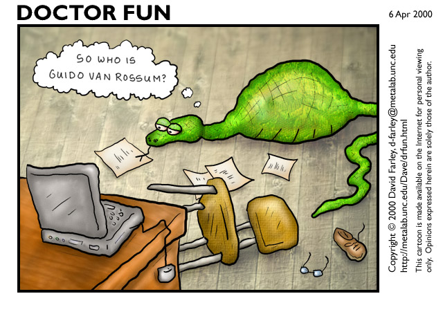

### Müfredat Planı

1. Giriş

2. Değişkenler, deyimler ve cümleler

3. İşlevler (Fonksiyonlar): `def`

4. Koşul ifadeleri: `if`, `elif`, `else`

5. Ürün veren işlevler: `return`

6. Yineleme: `while`

7. Dizgiler: `for`

9. Listeler

10. Modüller ve dosyalar

11. Özyineleme ve istisnalar

12. Sözlükler

13. Sınıflar ve nesneler: `class`



### Bilgi

- Yrd.Doç.Dr.Nurettin Şenyer

- Arş.Gör. Emre Gürbüz

- Arş.Gör. Erdem Alkım

- Yardımcı kitaplar: BBGD, İstihza, ...


### Bilgisayar Bilimcisi Gibi Düşünmek

TODO:



# Program

Program:
     bilgisayara bir işlem yaptırmak için belirli bir sırada biraraya
     getirilmiş komutlar dizisi (TDK Güncel Türkçe Sözlük, küçük
     değişikliklerle)

            -- TDK, Türkçe Güncel Sözlük


# Program → Tarif

- basitleştirilmiş bilgiişlem süreci:  girdi(ler) → işlem → çıktı(lar)
- "işlem"in tarifi
- yemek tarifi gibi...


### Yemek tarifi

- omlet yap▬
- nasıl?▬

.. code-block:: python
	:linenos:

	malzemeleri hazırla
	bir kaseye yumurtaları kır
	tuz ekle
	isteğe göre peynir ekle
	karışımı çırp
	tavaya yağ ekle
	tavayı kızdır
	kasedeki karışımı tavaya dök
	omleti pişir
	tabağa servis yap


### Program ve yemek tarifi

- girdiler
    + yumurta, tuz, yağ...
- çıktı
    + omlet
- yürütme sırası
    + önce tuz, sonra yumurtalar olmaz


### Bilgisayar - otomatik yemek makinesi

- böyle bir icat bildiğimiz kadarıyla yok▬
- ama olduğunu varsayalım▬
- mekanik aksamı olan bir tür bilgisayar


### Otomatik yemek makinesi

- tarifi **belirli kurallar çerçevesinde** yazıyor ve makineye **yüklüyoruz**
- "belirli kurallar" → bir tür **dil**, programlama dili
- makine komutları **yorumluyor**
    + bu noktada anlayamadığı bir komutla karşılaşabilir mi?
    + anlayamazsa devam da edemez
- makine herşeyi doğru anlamışsa çalışmaya hazır, fakat:
    + girdi gerekiyor
    + girdi yoksa çıktı da yok
- girdiler (yumurta, tuz vb) verildiğinde **çalıştır** düğmesine basıyoruz
    + ve belirli bir süre sonra çıktı üretiliyor: omlet


### Benzetmenin ögeleri

####  Otomatik yemek makinesi

- **tarif**
- tarifin hazırlanması
- tarifi yazan, **ahçı**
- tarifin yazıldığı dil
- tarifin yorumlanması
- hatasız yorumlanmış tarif
- yemeğin yapılması
- somut girdiler: yumurta ...
- somut çıktı: omlet

▬
|

#### Bilgisayar

- programın kaynak **kodu**
- yazılımın geliştirilmesi
- **programcı** (geliştirici)
- programlama dili
- programın derlenmesi
- derlenmiş program
- programın çalıştırılması
- soyut girdiler (sayı vb)
- çıktı: soyut/somut, muhtelif


### Doğal diller



### Programlama dilleri



### Doğal diller - Programlama dilleri

####  Doğal diller

- Türkçe, İngilizce, Zuluca ...
- belirli kurallar: gramer, sözdizimi
- yapıtaşları: kelimeler, noktalama işaretleri
- yanlış ifade → yanlış anlam
- ifade gücü, belagat

▬
|

#### Programlama dilleri

- Python, C, Icon ...
- belirli kurallar: gramer, sözdizimi
- yapıtaşları: yerleşik kelimeler, deyimler
- yanlış kod → hatalı program
- ifade gücü, usta işi kod



### Bilg.Bil. X Problem Çözme

- bilgisayar bilimcisi için tek ve en önemli yetenek **problem çözmedir**



### Problem nedir?

Problem,

- bir işlemin, otomasyonunun yada bilimsel hesaplamanın bilgisayarla çözülmesi fikrinin ortaya çıkması

- beyinle çözülmesi imkansız veya çok zor ve/veya zaman alıcıdır, hamaliyedir



### Problem çözme

- problemi formüle et, 

- çok sayıda çözümün üzerinde kafa yor ve yaratıcı düşün, 

- bulduğun çözümü açık ve kesin ifade et

- son adımı bilgisayar ortamında ifade ediyorsak ortaya çıkan ürün  **program**

- ifade dili: programlama dili

- adım adım açıklama: algoritma



### Neden programlama?

- **ancak** programlama yoluyla çözebileceğiniz problemlerle meslek hayatınız
  süresince sıklıkla karşılaşabilirsiniz

- mühendislik seviyesinde bilgiişlem okur yazarlığının bir parçası


### Python?

- Python **çok yüksek düzeyli bir programlama dili**

- yani `omlet yap`'a yakın ifadelerle programlar yazabileceksiniz



### Dil ve seviye

- yüksek seviyeli x düşük seviyeli: makine dili/birleştirici dil - C - Python/C++/Java

- makineye özel x taşınabilir

- kodlama süresi

- okunurluk-anlaşırlık

- makine diline (1/0) çevrim



### yüksek seviye-->düşük seviye geçişi

- bu amaç için iki yaklaşım kullanılır: **yorumlayıcı**, **derleyici**

- **yorumlayıcı**: yüksek seviyeli programı adım adım okur ve işletir, söylediklerini yerine getirir

- **derleyici**: program kodunu bilgisayarın anlayacağı dile çevirir.
    + girdi koduna: **kaynak kod**
    + elde edilen yeni koda: **hedef kod** veya **çalıştırılabilir kod**
    + bir kez hedef kod elde edildikten sonra defalarca çalıştırılabilir (sonsuz kez!)

- modern dillerin çoğu iki işlemi de kullanılır
    + program önce düşük seviyeli bir dile derlenir: **byte kod**
    + sonra **sanal makinede** yorumlanır

- Python, yorumlamalı bir dildir



### Python'un künyesi

+ GvR (Guido Van Rossum) tarafından geliştirilmiş

+ 17 yaşında (1991)

+ Piton yılanı değil "Monty Python" adlı İngiliz komedisi

+ GvR şimdi Google'da

+ Python her yerde: Google Apps, GUI, Blender, ...

+ dinamik X statik tiplemeli

+ çoklu platformlu



### GvR ???



### kabuk x betik

- yorumlayıcının iki modu vardır: kabuk ve betik



### Kabuk

- DEMO

.. code-block:: python                                                                                                       
        :linenos:                                                                                                            
	
	>>> print 1 + 1
	2

- Kabukta  `print 1 + 1` yazdık,▬ Python yorumladı ve ▬`2` çıktısını üretti▬

- `>>>`: Python'un bilgi istemcisi (prompt)
	+ Windows `:>`
	+ Linux `$`



### Betik

- DEMO
- dosyaya yaz, kaydet ve Python'la yorumla
- oluşturulan dosya: **betik dosyası**


### Betik

Betik oluştur: adı örneğin `ilkprogram.py`

- daha iyisi `01ilk_prog.py`

- `py`-Python program uzantısı

.. code-block:: python
	:linenos:                                                                                                            

	print 1 + 1

▬
|

Betiği yorumla,

.. code-block:: python
	:linenos:                                                                                                            

	$ python ilkprogram.py
	2


### Kabuk x betik

- kabuk: karalama alanı

- betik: gerçek programlar buraya



### 1.2 Program nedir?

Program:
	**hesaplamayı** gerekleştirmek için gereken birbirini izleyen yönergelerden (komutlardan) oluşan yapıdır.

hesaplama:
	matematiksel-kök hesabı; sembolik: metin arama, değiştirme; derleme


### Program

programlar üç esas parçadan oluşur: girdi, işlem ve çıktı

girdi:    
    Klavyeden, dosyadan veya başka bir aygıttan veriyi alma.

işlem:
	alınan veriler üzerinde çözüme götüren adımları uygulama.

çıktı:
    Ekranda veriyi görüntüleme veya veriyi bir dosya ya da başka bir aygıta gönderme.



### İşlemler

işlem öbeği matematiksel, koşullu yürütme ve tekrarlamalar içerir

matematik:    
    Toplama, çarpma gibi bazı temel matematiksel işlemleri gerçekleştirme.
  
koşullu yürütme:  
    Belirli durumlar için sınama yapma ve uygun cümle sırasını çalıştırma.
  
tekrarlama:    
    Bazı eylemleri genellikle ufak tefek bazı değişikliklerle tekrar tekrar yürütme.


### Hata ayıklama (degug)

- programlama karmaşıktır

- hatalar olur

- programlama hatalarına **bug** denilir

- bu hataların bulunup, düzeltilmesi işlemine **debug** denilir (hata ayıklama)

- üç tür hata vardır: sözdizimsel, çalışma zamanı ve anlambilimsel.



### Sözdizimsel (syntax error)

- programın yapısıyla alakalı

- Türkçe cümle büyük harfle başlar, noktalama işaretleri vs

- Türkçe'de göz ardı edebilirsiniz Python asla

- hata mesajı verip çıkar, bir şey üretemez

.. code-block:: python
	:linenos:                                                                                                            

	>>> 3 + * 9
	  File "<stdin>", line 1
	    3 + * 9
		^
	SyntaxError: invalid syntax
	>>>


### Çalışma zamanı

- program çalışırken ortaya çıkar

- **istisna** da denilir

.. code-block:: python
	:linenos:                                                                                                            

	>>> 10 * (1/0)
	Traceback (most recent call last):
	  File "<stdin>", line 1, in ?
	ZeroDivisionError: integer division or modulo by zero
	>>> 4 + spam*3
	Traceback (most recent call last):
	  File "<stdin>", line 1, in ?
	NameError: name 'spam' is not defined
	>>> '2' + 2
	Traceback (most recent call last):
	  File "<stdin>", line 1, in ?
	TypeError: cannot concatenate 'str' and 'int' objects

- `try-except`


### Anlambilimsel

- program çalışır, fakat doğru sonuç üretmez

- sorun yazılı program değil, çözüm kısmıdır

- bu tür hataları ayıklamak zordur



### Deneysel hata ayıklama

- dedektiflik

- bazıları için programlama ve hata ayıklama aynı şeydir

- çalışır küçük bir kodla başla

- yeni eklentiler, hata ayıklayarak ilerle

- docstring, doctest



### biçimsel ve doğal diller

- **doğal** diller: konuştuğumuz diller. Tasarlanmamıştır, doğal bir şekilde günümüze gelmiştir.

- **biçimsel** diller: tasarlanmış/geliştirilmiş diller. 

- Matematikteki sayılar ve semboller.
- Kimyacıların molekül gösterimi

- **programlama** dilleri de hesaplamaları ifade etmek için tasarlanmış biçimsel dillerdir.

- katı kurallar vardır.



### Token

- sözdizimsel kurallar: **token** + tokenların dizilişi.

token:
	dilin temel öğeleridir: kelimeler, sayılar, karakterler vs.

- tokenların nasıl dizildiği de önemlidir.



### tokens

- token, karakter dizisidir (dizgi). 

- kurala göre kategorize edilir

- parser yardımıyla parçalara ayrıştırılırlar

|
▬

ör. `sum = 2 + 3` ifadesinde

+ `sum`: belirteç (identifier, nesne) tokenı

+ `2` ve `3`: sayı tokenı

+ `+`: toplama işleci/tokenı



### Ayrıştırma (parsing)

Ayrıştırma (parsing):
	cümlenin yapısını çözme süreci



### Doğal x biçimsel dil ayrımları

- **belirsizlik**: Doğal diller belirsizlikle doludur, kişiler bağlamsal
  ipuçları ve diğer bilgilerden yararlanarak bu belirsizliği aşarlar. Biçimsel 
  diller neredeyse veya tamamen belirli olmak üzere tasarlanmıştır. Bunun anlamı
  cümlenin sadece bir anlamı vardır, bağlam ne olursa olsun.

- **fazlalık (redundancy)**: Belirsizliği önlemek ve yanlış anlamaları azaltmak
  için, doğal diller bir çok gereksiz içeriğe sahiptir. Bu yüzden bir çok
  fazlalık barındırır. Biçimsel diller fazlalık içermez, az ve öz olmalıdır.
        
- **gerçekçilik**: Doğal diller deyim ve **mecaz** larla doludur. Eğer biri
  "Ayaklarıma kara sular indi" diyorsa, bu ayaklarına kara sular indi anlamına
  gelmez, gizli bir anlamı vardır ve yorgun olduğunu belirtir. Biçimsel dillerde
  cümlelerin gerçeği aynen yansıtması gerekir, anlamı yazılanla aynı olmalıdır.



### Şiir - düzyazı - programlar

- **Şiir**: belirsizlik, mecaz.  Kelimeler anlamları olduğu kadar sesleri için
  de kullanılır, ve tüm şiir bir etki veya duygusal bir tepki yaratır.
  Belirsizlik yaygın olmasının yanında sıklıkla bir gerekliliktir.
  
- **Düzyazı**: gerçek anlam, belirsizlik.  Kelimelerin gerçek anlamı daha önemlidir, ve yapı
  anlama daha fazla katkı sağlar. Düzyazının şiire göre çözümlemesi daha kolaydır
  ancak yine de belirsizlikler içerebilir.
  
- **Programlar**: tek anlamlı, gerçek.  Bilgisayar programının anlamı belirli (tek anlamlı) ve
  gerçek olmalıdır, ve token ile yapının çözümlenmesiyle tamamen anlaşılmalıdır.



### sonuç

- biçimsel diller daha yoğundur, okuması/yazması daha fazla zaman alır.

- yapı önemlidir: yukarıdan-aşağıya, soldan-sağa okumak yeterli/doğru bir fikir değil

- kafanızda programı ayrıştırmayı, tokenleri ve yapıyı belirleme ve tanımlamayı öğrenmeniz gerekir.

- ayrıntılar önemlidir: yazım yanlışları ve noktalama hataları affedilmez.



### ilk program

- yeni programlama dili, yeni araç vs

- "merhaba, dunya"

.. code-block:: python
	:linenos:

	print "merhaba, dunya"

|
▬

- `print` ekrana çıktı veren bir **işlev** (iş yapan küçük program parçası)

- yazılacak mesaj çift tırnak içerisinde olmalıdır

- alternatif yöntemlerde vardır: tek tırnak, üç tırnak, değişkenin değerini yazdırma



### Neden Python

C'de "merhaba, dunya"

.. code-block:: c
	:linenos:
	:size: Tiny

	# include <stdio.h>

	int main() 
	{
	       printf("merhaba, dunya");
	       return 0;
	}

- kodla, derle, çalıştır

|

Java'da "merhaba, dunya"

.. code-block:: java
	:linenos:
	:size: Tiny

	// Hello World in Java

	class HelloWorld {
	  static public void main( String args[] ) {
	    System.out.println( "Hello World!" );
	  }
	}

- kodla, çalıştır



### "merhaba, dunya" - tek tırnak

çift tırnak yerine tek tırnakta kullanabiliriz

.. code-block:: python
        :linenos:

        print 'merhaba, dunya'



### özel karakterler - çok satır

- aşağıdaki biçimde çıktıyı nasıl üreteceğiz

.. code-block:: python
	:linenos:

	Insanlar basaklara benzerler,
	Icleri bosken baslari havadadir,
	Icleri doldukca ve olgunlastikca egilirler.
			--"Montaigne"--


### özel karakaterler - çok satır

- çok sayıda `print` satırı

.. code-block:: python
        :linenos:

  	print "Insanlar basaklara benzerler,"
        print "Icleri bosken baslari havadadir,"
        print "Icleri doldukca ve olgunlastikca egilirler."
        print "                --"Montaigne"--"

=
▬

Hoopps ...

.. code-block:: python
	:linenos:

	>>> print "                --"Montaigne"--"
	  File "<stdin>", line 1
	    print "                --"Montaigne"--"
	                                      ^
	SyntaxError: invalid syntax
	>>>



### özel karakterler - tek/çift tırnak

ters slaş karakteri veya tek tırnak

.. code-block:: python

	print "                --\"Montaigne\"--"
	print '                --"Montaigne"--'

- kaçış karakterleri = ters slaş (escape sequences)

- farklı amaçlar için de kullanılır

.. code-block:: python
	:linenos:

	print "\nmerhaba\ndunya"

- daha fazlası için: "http://www.python.org/doc/2.5.2/ref/strings.html"



### özel karakterler - üç tırnak

üç tırnak

.. code-block:: python
        :linenos:

        print """
	Insanlar basaklara benzerler,
	Icleri bosken baslari havadadir,
        Icleri doldukca ve olgunlastikca egilirler.
                        --\"Montaigne\"--
	"""

- `docstring` denilir

- `help()`, `doctest()`



### "merhaba, dunya" - açıklama satırı: diyez (`#`)

Açıklama satırları

.. code-block:: python
	:linenos:

	# Dosya ismi: 01_merhaba.py
	# Bu ilk programimiz.
	# Tarih: 01.03.2010

	print "merhaba, dunya"		# ekrana yaz



### "merhaba, dunya" - açıklama satırı - üç tırnak

Açıklama satırları

.. code-block:: python
	:linenos:

	""" Dosya ismi: 01_merhaba.py
	Bu ilk programimiz.
	Tarih: 01.03.2010
	"""

	print "merhaba, dunya"



### "merhaba, dunya" - çalıştırılabilir betik

- Python: kabuk, betik

- betikleri çalıştırırken: `$ python 01_merhaba.py` 

- kendi başına çalışır yapmak mümkün mü?

- yani: `$ ./01_merhaba.py`

.. code-block:: python
	:linenos:
	
	#! /usr/bin/env python
	#
	# Dosya ismi: 01_merhaba.py
        # Bu ilk programimiz.
        # Tarih: 01.03.2010

        print "merhaba, dunya"          # ekrana yaz

- ve betik dosyasına çalışma izni ekleyin: `$ chmod a+x 01_merhaba.py`

- şimdi çalıştırın: `$ ./01_merhaba.py`



### Python oturumu - hesap makinesi

- DEMO

- hesap makinesi: `+, -, *, /, %`

- değişken kavramı: `asn, dsn, ort`

- print cümlesi: `print ort`

- uygulama: not hesaplayıcı

.. code-block:: python
	:linenos:

[% CODE("01_ort.py") %]



### basit girdi: `input` - `raw_input`

.. code-block:: python
	:linenos:

[% CODE("01_ort_input.py") %]



### Sıra sizde

Aşağıdaki kavramları tanımlayın

- algoritma, bug, byte kod, derleme, hata ayıklama, istisna, çalıştırılabilir, biçimsel dil
- yüksek seviyeli dil, düşük seviyeli dil, doğal dil, hedef kod, ayrıştırma, taşınabilirlik
- print cümlesi, problem çözme, program, Python kabuğu, çalışma zamanı hatası, betik
- anlambilimsel hata, anlambilim, kaynak kod, sözdizimi, sözdizim hatası, token


