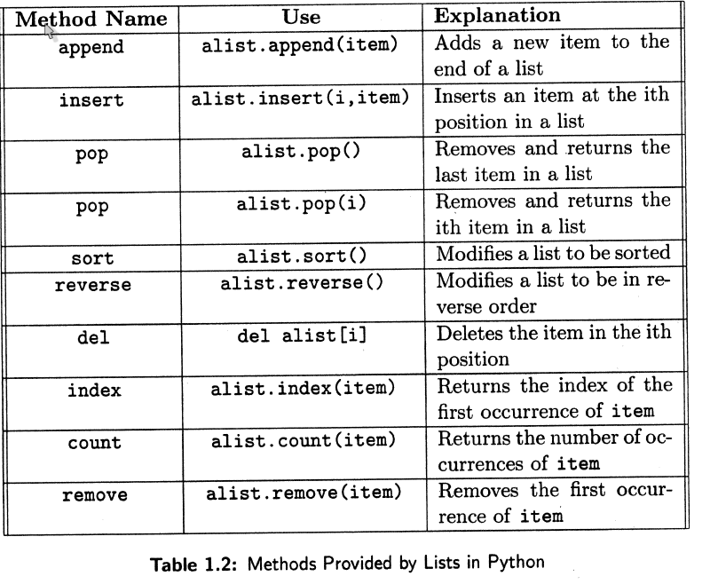

-------------------------------------------------------------------
modüller
-------------------------------------------------------------------

Modül:

- diğer Python programları tarafından kullanılmak üzere Python tanımlamaları ve 

- cümlelerini içeren bir **dosya** dır.

- Standart/yerleşik kütüphanenin parçasından modüller: doctest, string



-------------------------------------------------------------------
pydoc
-------------------------------------------------------------------

- pydoc modülü, sistemde kurulu Python kütüphanelerinde arama yapmada kullan

.. code-block:: python

	$ pydoc -g

- "open browser"i deneyin

- sistemdeki Python tarafından bulunan bütün python kütüphanelerinin bir listesidir.



-------------------------------------------------------------------
ör. keyword
-------------------------------------------------------------------

ör. keyword

.. code-block:: python
	
	Functions
	iskeyword = __contains__(...)
		x.__contains__(y) <==> y in x.

	Data
    __all__ = ['iskeyword', 'kwlist']
	kwlist = ['and', 'as', 'assert', 'break', 'class', 
	'continue', 'def', 'del', 'elif', 'else', 'except', 
	'exec', 'finally', 'for', 'from', 'global', 'if', 
	'import', 'in', 'is', ...]	



-------------------------------------------------------------------
renklendirme
-------------------------------------------------------------------

Çoğu modülün belgeleri üç renkli kod kısımları içermektedir:

- Sınıflar pembe

- Fonksiyonlar turuncu

- Veri yeşil



-------------------------------------------------------------------
özet
-------------------------------------------------------------------

- Sınıflar daha sonraki bölümlerde anlatılacaktır, 

- ama şimdilik pydoc'u modüller içerisindeki **fonksiyonları** ve 

- **verileri** görmek için kullandığımızı bilin



-------------------------------------------------------------------
keyword modülü
-------------------------------------------------------------------

keyword modülü: fonksiyonları

.. code-block:: python
	:linenos:

	>>> from keyword import *
	>>> iskeyword('for')
	True
	>>> iskeyword('all')
	False
	>>>

|

keyword modülü: verileri

.. code-block:: python
	:linenos:

	>>> from keyword import *
	>>> print kwlist
	['and', 'as', 'assert', 'break', 'class', 'continue', 'def', 'del', 'elif',
	'else', 'except', 'exec', 'finally', 'for', 'from', 'global', 'if', 'import',
	'in', 'is', 'lambda', 'not', 'or', 'pass', 'print', 'raise', 'return', 'try',
	'while', 'with', 'yield']
	>>>



-------------------------------------------------------------------
modül oluşturma
-------------------------------------------------------------------

- betik dosyasından çok farklı bir şey değil!

.. code-block:: python
	:linenos:

	#  seqtools.py
	#
	def remove_at(pos, seq):
		return seq[:pos] + seq[pos+1:]



-------------------------------------------------------------------
kendi modülünüzü kullanma
-------------------------------------------------------------------

- hem betikte hem de kabukta kullanabilirsiniz

- bunun için içe aktarmak (_import_) gerekir

- bu ise iki şekilde olur

=

ilk yol

.. code-block:: python
	:size: Tiny

	>>> from seqtools import remove_at
	>>> s = "A string!"
	>>> remove_at(4, s)
	'A sting!'

|

ikinci yol

.. code-block:: python
	:size: Tiny

	>>> import seqtools
	>>> s = "A string!"
	>>> seqtools.remove_at(4, s)
	'A sting!'



-------------------------------------------------------------------
özet
-------------------------------------------------------------------

- ilkinde `remove_at` daha önce gördüğümüz fonksiyonlar gibi çağrıldı.

- ikincisinde modülün ismi ve bir nokta (.) fonksiyon isminden önce yazıldı.

- iki durumda da dosyayı içe aktarırkan .py uzantısını yazmadığımıza dikkat edin.

- modül kullanımı çok büyük programları **yönetilebilir** büyüklükte parçalara bölmemize 

- ve **ilişkili** parçaları birlikte tutmamıza yaramaktadır.



-------------------------------------------------------------------
isim uzayı
-------------------------------------------------------------------

- isim uzayı sözdizimsel bir kaptır. 

- her modül kendi isim uzayını belirler, 

- aynı ismi farklı modüllerde tanımlama problemi oluşmaz

=

ilk modül

.. code-block:: python
	:size: Tiny

	# module1.py

	question = "What is the meaning of life,\
			   the Universe, and everything?"
	answer = 42

|

ikinci modül

.. code-block:: python
	:size: Tiny

	# module2.py

	question = "What is your quest?"
	answer = "To seek the holy grail."



-------------------------------------------------------------------
isim uzayı
-------------------------------------------------------------------

her iki modülü içeri aktarıp içerisindeki (aynı isimli) değişkenlere erişebiliriz

.. code-block:: python
	:size: Tiny

	>>> import module1
	>>> import module2
	>>> print module1.question
	What is the meaning of life, the Universe, and everything?
	>>> print module2.question
	What is your quest?
	>>> print module1.answer
	42
	>>> print module2.answer
	To seek the holy grail.
	>>>

- Eğer `from module1 import *` ve `from module2 import *` yazsaydık???▬

- **isimlendirme çakışması**, sonuç: module1.question|answer erişilemez



-------------------------------------------------------------------
isim uzayı: fonksiyonlar
-------------------------------------------------------------------

- fonksiyonlar da kendi isim uzaylarına sahiptir

.. code-block:: python
	:linenos:
	:size: Tiny

	def f():
		n = 7
		print "printing n inside of f: %d"  % n

	def g():
		n = 42
		print "printing n inside of g: %d"  % n

	n = 11
	print "printing n before calling f: %d"  % n
	f()
	print "printing n after calling f: %d"  % n
	g()
	print "printing n after calling g: %d"  % n

=

- çıktısı

.. code-block:: python
	:linenos:
	:size: Tiny

	printing n before calling f: 11
	printing n inside of f: 7
	printing n after calling f: 11
	printing n inside of g: 42
	printing n after calling g: 11

- üç n burada çakışmaz çünkü her biri ayrı isim uzayındadır.



-------------------------------------------------------------------
isim uzayı: özet
-------------------------------------------------------------------

İsim uzayları birden fazla programcının **aynı** projede *isim çakışmalarıyla*
karşılaşmadan **birlikte** çalışmasına olanak sağlar.



-------------------------------------------------------------------
özellikler ve nokta işleci
-------------------------------------------------------------------

- modül içerisinde tanımlanmış olan değişkenlere modülün **özellikleri** denir. 

- Bu özelliklere nokta işleci (.) ile **erişilir**. 

- ör. module1 ve module2'nin question özelliklerine 

- module1.question ve module2.question şeklinde erişilmektedir.



-------------------------------------------------------------------
özellikler ve nokta işleci
-------------------------------------------------------------------

modüle ait fonksiyonlara erişmek için  de nokta işleci kullanılır

.. code-block:: python
	:linenos:
	:size: Tiny

	>>> import string
	>>> string.capitalize('maryland')
	'Maryland'
	>>> string.capwords("what's all this, then, amen?")
	"What's All This, Then, Amen?"
	>>> string.center('How to Center Text Using Python', 70)
	'                   How to Center Text Using Python                    '
	>>> string.upper('angola')
	'ANGOLA'
	>>> 



-------------------------------------------------------------------
karakter dizisi ve liste metotları
-------------------------------------------------------------------

- string modülündeki bir çok işlev karakter dizisi nesnesine de eklenmiştir

- yeni eklentiler **metod** olarak adlandırılır

.. code-block:: python

	>>> 'maryland'.capitalize()
	'Maryland'
	>>> "what's all this, then, amen?".title()
	"What'S All This, Then, Amen?"
	>>> 'How to Center Text Using Python'.center(70)
	'                   How to Center Text Using Python                    '
	>>> 'angola'.upper()
	'ANGOLA'
	>>>



-------------------------------------------------------------------
liste metotları
-------------------------------------------------------------------

nokta işleci nesnelerin yerleşik metotlarına erişmek için kullanılır

.. code-block:: python
	:linenos:
	:size: Tiny

	>>> mylist = []
	>>> mylist.append(5)
	>>> mylist.append(27)
	>>> mylist.append(3)
	>>> mylist.append(12)
	>>> mylist
	[5, 27, 3, 12]
	>>>



-------------------------------------------------------------------
liste metotları
-------------------------------------------------------------------

diğerleri



-------------------------------------------------------------------
kullanım
-------------------------------------------------------------------

kullanım

.. code-block:: python
	:linenos:
	:size: Tiny

	>>> mylist.insert(1, 12)
	>>> mylist
	[5, 12, 27, 3, 12]
	>>> mylist.count(12)
	2
	>>> mylist.extend([5, 9, 5, 11])
	>>> mylist
	[5, 12, 27, 3, 12, 5, 9, 5, 11])
	>>> mylist.index(9)
	6
	>>> mylist.count(5)
	3
	>>> mylist.reverse()
	>>> mylist
	[11, 5, 9, 5, 12, 3, 27, 12, 5]
	>>> mylist.sort()
	>>> mylist
	[3, 5, 5, 5, 9, 11, 12, 12, 27]
	>>> mylist.remove(12)
	>>> mylist
	[3, 5, 5, 5, 9, 11, 12, 27]
	>>>



-------------------------------------------------------------------
metin dosyalarını okuma ve yazma
-------------------------------------------------------------------

- programın çalışırken kullandığı bellek-RAM, geçici

- kalıcı olarak saklamak istersek dosya kullanın

- dosyayı kullanmak için bir isim verip, açmak gerekir

.. code-block:: python
	:linenos:

	>>> myfile = open('test.dat', 'w')
	>>> print myfile
	<open file 'test.dat', mode 'w' at 0x2aaaaab80cd8>

- open fonksiyonu iki argüman almaktadır. 

1. dosyanın ismi

2. mod: 'w' modu = yazma 



-------------------------------------------------------------------
dosyaya yazma
-------------------------------------------------------------------

dosyaya yazma veya veri koyma

.. code-block:: python
	:linenos:

	>>> myfile.write("Now is the time")
	>>> myfile.write("to close the file")

=

- dosyaya yazma işimizin bittiğini söylememiz gerekir

- bunun için kapama yapılır

.. code-block:: python
	:linenos:

	>>> myfile.close()



-------------------------------------------------------------------
dosyadan veri okuma
-------------------------------------------------------------------

dosyadan veri okuma

.. code-block:: python
	:linenos:

	>>> myfile = open('test.dat', 'r')

=

dosya yoksa

.. code-block:: python
	:linenos:

	>>> myfile = open('test.cat', 'r')
	IOError: [Errno 2] No such file or directory: 'test.cat'



-------------------------------------------------------------------
dosyadan veri okuma
-------------------------------------------------------------------

`read` işlevi argümansız işletilirse tüm dosyayı tek seferde okur

.. code-block:: python
	:linenos:

	>>> text = myfile.read()
	>>> print text
	Now is the timeto close the file

=

- okunacak karakter sayısını girebiliriz

.. code-block:: python
	:linenos:

	>>> myfile = open('test.dat', 'r')
	>>> print myfile.read(5)
	Now i

- okumaya devam edebiliriz

.. code-block:: python
	:linenos:

	>>> print myfile.read(1000006)
	s the timeto close the file
	>>> print myfile.read()
	   
	>>>

- dosyada veri kalmayınca boş dizgi döner



-------------------------------------------------------------------
dosya kopyala
-------------------------------------------------------------------

dosya kopyala

.. code-block:: python
	:linenos:
	:size: Tiny

	def copy_file(oldfile, newfile):
		infile = open(oldfile, 'r')
		outfile = open(newfile, 'w')
		while True:
			text = infile.read(50)
			if text == "":
				break
			outfile.write(text)
		infile.close()
		outfile.close()
		return

- şifrele sakla: 50 karakterin yerini değiştir (kontrollü shuffle)

- şifrele sakla: her bir harfi başka bir harfle değiştir

- hash'ini sakla

- filtrele sakla: küçük harfleri filtrele



-------------------------------------------------------------------
metin dosyaları
-------------------------------------------------------------------

metin dosyası 

- yazdırılabilir karakterler ve beyaz boşluklar içeren,

- satırlar şeklinde düzenlenmiş, 

- satırları yeni satır karakterleriyle ayrılmış

dosyadır. 



-------------------------------------------------------------------
dosyaya yazma
-------------------------------------------------------------------

dosyaya yazma

.. code-block:: python
	:linenos:
	:size: Tiny

	>>> outfile = open("test.dat","w")
	>>> outfile.write("line one\nline two\nline three\n")
	>>> outfile.close()

- yeni satır karakterine dikkat

=

şimdi okuyalım

.. code-block:: python
	:linenos:
	:size: Tiny

	>>> infile = open("test.dat","r")
	>>> print infile.readline()
	line one
	   
	>>>



-------------------------------------------------------------------
satırları okuma
-------------------------------------------------------------------

- tüm satırları okumak

.. code-block:: python
	:linenos:

	>>> print infile.readlines()
	['line two\012', 'line three\012']

- dosya sonuna ulaşınca `readline` boş satır, `readlines` boş liste döndürür

.. code-block:: python
	:linenos:

	>>> print infile.readline()
	   
	>>> print infile.readlines()
	[]



-------------------------------------------------------------------
örnek
-------------------------------------------------------------------

satır işleme programı

.. code-block:: python
	:linenos:
	:size: Tiny

	def filter(oldfile, newfile):
		infile = open(oldfile, 'r')
		outfile = open(newfile, 'w')
		while True:
			text = infile.readline()
			if text == "":
			   break
			if text[0] == '#':
			   continue
			outfile.write(text)
		infile.close()
		outfile.close()
		return

- dosyayi ikiye ayirin bir dosya aciklamalari, digeri ise programi icersin



-------------------------------------------------------------------
dizinler
-------------------------------------------------------------------

- dosyalar, dosya sisteminde dizinler içerisinde saklanırlar

- dizinler ise hem dosyalara hem de alt dizinlerine ev sahipliği ederler

- açmaya/kaydetmeye çalıştığınız dosyalar **aynı** dizinde olmalıdır

- **farklı** dizinlerle çalışmak istersek?

- konumunu (**path**) söylemeliyiz

.. code-block:: python
	:linenos:

	>>> wordsfile = open('/usr/share/dict/words', 'r')
	>>> wordlist = wordsfile.readlines()
	>>> print wordlist[:5]
	['\n', 'A\n', "A's\n", 'AOL\n', "AOL's\n", 'Aachen\n']



-------------------------------------------------------------------
counting Letters
-------------------------------------------------------------------

`ord` fonksiyonu bir karakterin tamsayı temsilini döndürmektedir:

.. code-block:: python
	:linenos:

	>>> ord('a')
	97
	>>> ord('A')
	65
	>>>

- `'Apple' < 'apple'`, `True` veya `False` ????



-------------------------------------------------------------------
chr işlevi
-------------------------------------------------------------------

- `chr` fonksiyonu `ord` fonksiyonunun tersidir.

- tamsayı --> karakter

.. code-block:: python
	:linenos:

	>>> for i in range(65, 71):
	...     print chr(i)
	...
	A
	B
	C
	D
	E
	F
	>>>



-------------------------------------------------------------------
örnek
-------------------------------------------------------------------

- countletters.py: karakter histogramı 

.. code-block:: python
	:linenos:
	:size: Tiny

[% CODE("d10_countletters.py") %]



-------------------------------------------------------------------
sys modülü ve argv
-------------------------------------------------------------------

- `sys` modülü python yorumlayıcının çalıştığı ortam hakkında bilgi/erişim sağlar

.. code-block:: python
	:linenos:
	:size: Tiny

	>>> import sys
	>>> sys.platform
	'linux2'
	>>> sys.path
	['', '/home/jelkner/lib/python', '/usr/lib/python25.zip', '/usr/lib/python2.5',
	'/usr/lib/python2.5/plat-linux2', '/usr/lib/python2.5/lib-tk',
	'/usr/lib/python2.5/lib-dynload', '/usr/local/lib/python2.5/site-packages',
	'/usr/lib/python2.5/site-packages', '/usr/lib/python2.5/site-packages/Numeric', 
	'/usr/lib/python2.5/site-packages/gst-0.10',
	'/var/lib/python-support/python2.5', '/usr/lib/python2.5/site-packages/gtk-2.0',
	'/var/lib/python-support/python2.5/gtk-2.0']
	>>> sys.version
	'2.5.1 (r251:54863, Mar  7 2008, 04:10:12) \n[GCC 4.1.3 20070929 (prerelease)
	(Ubuntu 4.1.2-16ubuntu2)]'
	>>> 



-------------------------------------------------------------------
argv
-------------------------------------------------------------------

- `argv` değişkeni Python betiği çalıştırıldığında komut satırından okunan 

- karakter dizilerinin listesini tutmaktadır. 

- Bu komut satırı argümanları program başlarken programa bilgi geçirmeye yardımcı olur.

.. code-block:: python
	:linenos:
	:size: Tiny

	#
	# demo_argv.py
	#
	import sys

	print sys.argv

|

böyle deneyin

.. code-block:: python
	:linenos:
	:size: Tiny

	$ python demo_argv.py this and that 1 2 3
	['demo_argv.py', 'this', 'and', 'that', '1', '2', '3']
	$

- dosya kopyalamayı vd bununla güncelleyin

- ilk eleman programın ismi

- bir de böyle deneyin (beyaz boşluklar)

.. code-block:: python
	:linenos:
	:size: Tiny

	$ python demo_argv.py "this and" that "1 2" 3
	['demo_argv.py', 'this and', 'that', '1 2', '3']
	$ 



-------------------------------------------------------------------
örnek
-------------------------------------------------------------------

- komut satırından girilen sayı dizisinin toplamını alan program:

.. code-block:: python
	:linenos:
	:size: Tiny

	#
	# sum.py
	#
	from sys import argv

	nums = argv[1:]

	for index, value in enumerate(nums):
		nums[index] = float(value)

	print sum(nums)

- `from <module> import <attribute>` şeklinde içe aktarmayı kullanmaktayız, 

- böylece argv modülün isim uzayına alınmış oluyor.

=

- demo 

.. code-block:: python
	:linenos:
	:size: Tiny

	$ python sum.py 3 4 5 11
	23
	$ python sum.py 3.5 5 11 100
	119.5



-------------------------------------------------------------------
dizinlerde dolaşma
-------------------------------------------------------------------

cook/python/src altındaki

- dir_file_processing.py

- dir_walk.py

- os_listdir.py

- pdfnot.py



-------------------------------------------------------------------
sıra sizde
-------------------------------------------------------------------

myreplace: split, join kullanılacak

.. code-block:: python
	:linenos:
	:size: Tiny

	def myreplace(old, new, s):
		"""
		Replace all occurances of old with new in the string s.

		   >>> myreplace(',', ';', 'this, that, and, some, other, thing')
		   'this; that; and; some; other; thing'
		   >>> myreplace(' ', '**', 'Words will now be separated by stars.')
		   'Words**will**now**be**separated**by**stars.'
		"""


-------------------------------------------------------------------
diğerleri
-------------------------------------------------------------------

- **d10_wordtools.py**

- unsorted_fruits.txt dosyası her biri farklı bir karakterle başlayan 26 tane meyve içermektedir. sırala

- medyan değer

.. code-block:: python
	:linenos:

	$ python median.py 3 7 11
	7
	$ python median.py 19 85 121
	85
	$ python median.py 11 15 16 22
	15.5

- countletters.py programını dosyayı komut satırı argümanı olarak alacak şekilde değiştirin. Çıktı dosyasını isimlendirmeyi nasıl çözersiniz?



-------------------------------------------------------------------
CSV
-------------------------------------------------------------------

oku

.. code-block:: python
	:linenos:
	:size: Tiny

	import csv
	reader = csv.reader(open("some.csv", "rb"))
	for row in reader:
		print row



-------------------------------------------------------------------
yazma
-------------------------------------------------------------------

yazma

.. code-block:: python
	:linenos:
	:size: Tiny

	# File: csv-example-4.py

	import csv
	import sys

	data = [
		("And Now For Something Completely Different", 1971, "Ian MacNaughton"),
		("Monty Python And The Holy Grail", 1975, "Terry Gilliam, Terry Jones"),
		("Monty Python's Life Of Brian", 1979, "Terry Jones"),
		("Monty Python Live At The Hollywood Bowl", 1982, "Terry Hughes"),
		("Monty Python's The Meaning Of Life", 1983, "Terry Jones")
	]

	writer = csv.writer(sys.stdout)

	for item in data:
		writer.writerow(item)

	$ python csv-example-4.py
	And Now For Something Completely Different,1971,Ian MacNaughton
	Monty Python And The Holy Grail,1975,"Terry Gilliam, Terry Jones"
	Monty Python's Life Of Brian,1979,Terry Jones
	Monty Python Live At The Hollywood Bowl,1982,Terry Hughes
	Monty Python's The Meaning Of Life,1983,Terry Jones


